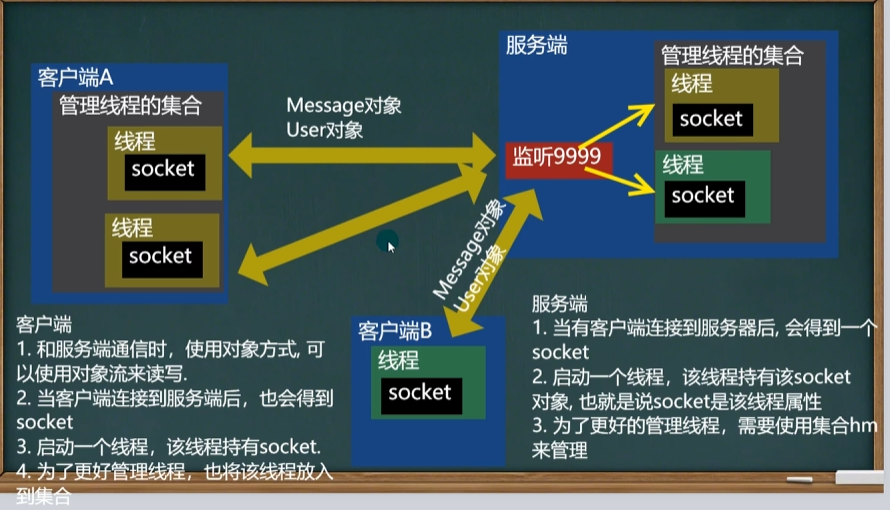
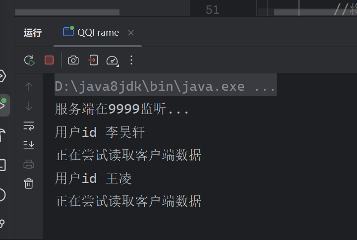
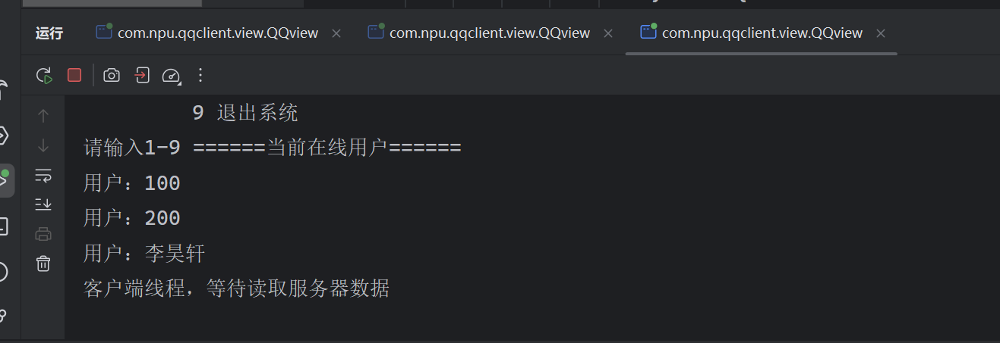
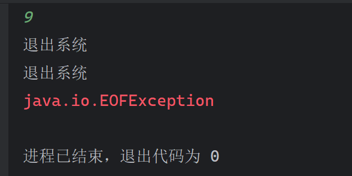
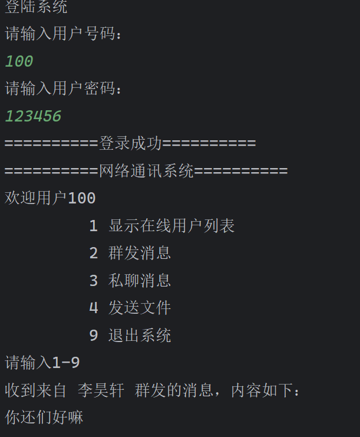
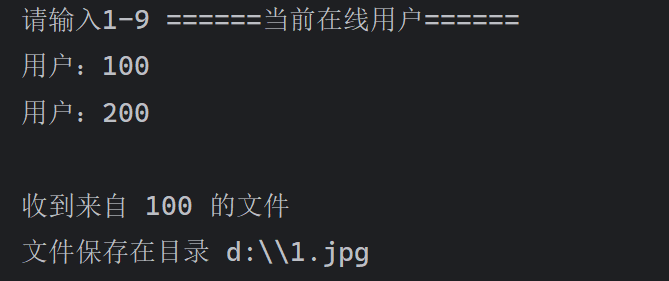
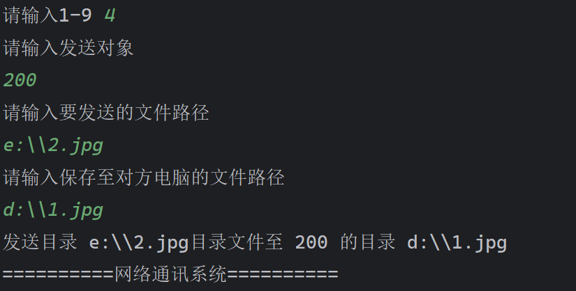

# 多用户通信系统

## 功能实现

1.用户登录

2.拉取用户列表

3.私聊

4.群聊

5.发文件

## 思路分析

当客户端与服务端产生链接的时候，服务端会产生一个socket，必须要创建一个线程来持有并管理产生的socket

服务器端的多个线程需要一个管理线程的集合，用以后续的服务器推送新闻

每一个客户端也可能会创建多个线程，和服务器端通信，需要客户端线程的管理集合（hashmap）



### 服务端

1.当客户端连接到服务器时得到了socket

2.启动了一个线程，该线程持有socket，socket是线程的属性

3.为了管理线程，用集合hashmap管理线程，将线程放入集合

### 客户端

1.和服务端通信的时候使用对象的方式，可以使用对象流来进行读写

2.当客户端连接到服务器端时，会得到socket

3.启动一个线程，该线程持有socket

4.为了管理线程，用集合hashmap管理线程，将线程放入集合

## 代码实现

### 1.用户登录

创建User对象，表示一个用户信息（如果对象要在IO中传输，对象需要进行序列化）

```java
package com.npu.qqcommon;

import java.io.Serializable;

//表示一个用户信息
public class User implements Serializable {
    private static final long serialVersionUID = 1L;//增强兼容性
    private String userId;//用户名
    private String password;

    User(String userId, String password) {
        this.userId = userId;
        this.password = password;
    }

    public String getUserId() {
        return userId;
    }

    public void setUserId(String userId) {
        this.userId = userId;
    }

    public String getPassword() {
        return password;
    }

    public void setPassword(String password) {
        this.password = password;
    }
}
```

创建Message对象，表示客户端和服务端通信时的消息对象

```java
package com.npu.qqcommon;

import java.io.Serializable;

//表示客户端和服务端通信时的消息对象
public class Message implements Serializable {
    private static final long serialVersionUID = 1L;
    private String sender;//发送者
    private String getter;//接收者
    private String content;//消息内容
    private String sendTime;//发送时间
    private String mesType;//消息类型【可以在接口定义消息类型】

    public String getMesType() {
        return mesType;
    }

    public void setMesType(String mesType) {
        this.mesType = mesType;
    }

    public String getSender() {
        return sender;
    }

    public void setSender(String sender) {
        this.sender = sender;
    }

    public String getGetter() {
        return getter;
    }

    public void setGetter(String getter) {
        this.getter = getter;
    }

    public String getContent() {
        return content;
    }

    public void setContent(String content) {
        this.content = content;
    }

    public String getSendTime() {
        return sendTime;
    }

    public void setSendTime(String sendTime) {
        this.sendTime = sendTime;
    }
}
```

MessageType接口

```java
package com.npu.qqcommon;

public interface MessageType {
    String MESSAGE_LOGIN_SUCCEED = "1";//登录成功
    String MESSAGE_LOGIN_FAIL = "2";//登录失败
}
```

#### 客户端

客户端聊天的菜单界面（内部逻辑）

```java
package com.npu.qqcommon;

import java.util.Scanner;

public class QQview {
    //显示主菜单
    private boolean loop = true;
    private String key = "";
    Scanner scanner = new Scanner(System.in);

    public static void main(String[] args) {
        QQview qqview = new QQview();
        qqview.mainMenu();
        System.out.println("退出聊天系统");
    }

    public void mainMenu() {
        while (loop) {
            System.out.println("==========欢迎来到网络登录系统==========");
            System.out.println("\t\t 1 登陆系统");
            System.out.println("\t\t 9 退出系统");
            System.out.print("请输入1-9： ");
            key = scanner.next();
            switch (key) {
                case "1":
                    System.out.println("登陆系统");
                    System.out.println("请输入用户号码： ");
                    String userId = scanner.next();
                    System.out.println("请输入用户密码： ");
                    String password = scanner.next();
                    //将用户密码和用户名称发送到服务端，暂定
                    if (true) {
                        System.out.println("==========登录成功==========");
                        while (loop) {
                            System.out.println("==========网络通讯系统==========");
                            System.out.println("欢迎用户" + userId);
                            System.out.println("\t\t 1 显示在线用户列表");
                            System.out.println("\t\t 2 群发消息");
                            System.out.println("\t\t 3 私聊消息");
                            System.out.println("\t\t 4 发送文件");
                            System.out.println("\t\t 9 退出系统");
                            System.out.print("请输入1-9 ");
                            key = scanner.next();
                            switch (key) {
                                case "1":
                                    System.out.println("显示在线用户列表");
                                    break;
                                case "2":
                                    System.out.println("群发消息");
                                    break;
                                case "3":
                                    System.out.println("私聊消息");
                                    break;
                                case "4":
                                    System.out.println("发送文件");
                                    break;
                                case "9":
                                    System.out.println("退出系统");
                                    loop = false;
                                    break;
                            }

                        }
                    } else {
                        System.out.println("==========登陆失败==========");
                    }
                    break;
                case "9":
                    System.out.println("==========登陆退出==========");
                    loop = false;
                    break;
            }

        }
    }
}

```

线程服务类

```java
package com.npu.qqclient.service;

import com.npu.qqcommon.Message;
import com.npu.qqcommon.MessageType;
import com.npu.qqcommon.User;

import java.io.IOException;
import java.io.ObjectInputStream;
import java.io.ObjectOutputStream;
import java.net.InetAddress;
import java.net.Socket;


public class UserClientService {
    private User u = new User();//因为要在其他地方使用属性
    private Socket socket;

    public Socket getSocket() {
        return socket;
    }

    public void setSocket(Socket socket) {
        this.socket = socket;
    }

    //用以判断是否登录正确，消息来自于服务端按
    public boolean checkUser(String userId, String password) {
        boolean b = false;
        u.setUserId(userId);
        u.setPassword(password);
        //连接到服务器，发送u对象
        try {
            socket = new Socket(InetAddress.getByName("127.0.0.1"), 9999);
            ObjectOutputStream oos = new ObjectOutputStream(socket.getOutputStream());
            oos.writeObject(u);//发送User对象
            
            //读取收到的Message对象
            ObjectInputStream ois = new ObjectInputStream(socket.getInputStream());
            Message ms = (Message) ois.readObject();
            if(ms.getMesType().equals(MessageType.MESSAGE_LOGIN_SUCCEED)){
                //创建一个和服务器端保持通信的线程->创建线程类 ClientConnectServerThread
                ClientConnectServerThread clientConnectServerThread = new ClientConnectServerThread(socket);
                clientConnectServerThread.start();
                //为了方便管理，将线程放入一个集合中ManageClientConnectServerThread
                ManageClientConnectServerThread.addClientConnectServerThread(userId, clientConnectServerThread);
                b = true;
            } else {
                //登陆失败不启动线程，关闭没有用到的socket
                socket.close();
            }

        } catch (Exception e) {
            e.printStackTrace();
        }
        return b;
    }
}

```

其中创建的线程是一个类，含有socket对象

```java
package com.npu.qqserver.server;

import com.npu.qqcommon.Message;
import com.npu.qqcommon.MessageType;
import com.npu.qqcommon.User;

import java.io.IOException;
import java.io.ObjectInputStream;
import java.io.ObjectOutputStream;
import java.net.ServerSocket;
import java.net.Socket;

//服务端监听9999端口，等待客户端连接，保持通信
public class QQServer {
    private ServerSocket ss = null;

    public QQServer() {
        try {
            System.out.println("服务端在9999监听...");
            ss = new ServerSocket(9999);
            while(true) {
                Socket socket = ss.accept();
                ObjectInputStream ois = new ObjectInputStream(socket.getInputStream());
                ObjectOutputStream oos = new ObjectOutputStream(socket.getOutputStream());
                User u = (User) ois.readObject();
                //将数据进行验证，但是这没有数据库，模拟一个验证流程
                Message message = new Message();
                if(u.getUserId().equals("100") && u.getPassword().equals("123456")) {
                    //登陆成功，向客户端发送连接信息
                    message.setMesType(MessageType.MESSAGE_LOGIN_SUCCEED);
                    oos.writeObject(message);

                    //创建线程持有socket对象
                    ServerConnectClientThread serverConnectClientThread = new ServerConnectClientThread(socket, u.getUserId());
                    serverConnectClientThread.start();

                    //将线程放入集合
                    ManageClientThreads.addClientThread(u.getUserId(),serverConnectClientThread);
                } else {
                    //登陆失败
                    System.out.println("用户 " + u.getUserId() + "登录无效");
                    message.setMesType(MessageType.MESSAGE_LOGIN_FAIL);
                    oos.writeObject(message);
                    socket.close();
                }
            }
        } catch (Exception e) {
            e.printStackTrace();
        } finally {
            //如果服务端退出循环，服务器端不再监听
            try{
                ss.close();
            } catch (IOException e) {
                e.printStackTrace();
            }
        }
    }
}
true){
            try{
                System.out.println("客户端线程，等待读取服务器数据");
                ObjectInputStream ois = new ObjectInputStream(socket.getInputStream());
                Message message = (Message) ois.readObject();//没有发送对象 线程发送阻塞
                //其余处理
            } catch (Exception e) {
                e.printStackTrace();
            }
        }

    }

    public Socket getSocket() {
        return socket;
    }

    public void setSocket(Socket socket) {
        this.socket = socket;
    }
}
```

又在服务类里面创建了一个现成的集合对象

```java
package com.npu.qqclient.service;

import java.util.HashMap;

//管理客户端带服务端线程的一个类
public class ManageClientConnectServerThread {
    //把多个线程放入一个hashmap集合中，key是用户id， value是线程
    public static HashMap<String, ClientConnectServerThread> hm = new HashMap<>();

    //将线程加入
    public static void addClientConnectServerThread(String userId, ClientConnectServerThread clientConnectServerThread) {
        hm.put(userId, clientConnectServerThread);
    }
    //用id取出线程
    public static ClientConnectServerThread getClientConnectServerThread(String userId) {
        return hm.get(userId);
    }
}
```

#### 服务器

基本的服务流程

```java
package com.npu.qqserver.server;

import com.npu.qqcommon.Message;
import com.npu.qqcommon.MessageType;
import com.npu.qqcommon.User;

import java.io.ObjectInputStream;
import java.io.ObjectOutputStream;
import java.net.ServerSocket;
import java.net.Socket;

//服务端监听9999端口，等待客户端连接，保持通信
public class QQServer {
    private ServerSocket ss = null;

    public QQServer() {
        try {
            System.out.println("服务端在9999监听...");
            ss = new ServerSocket(9999);
            while(true) {
                Socket socket = ss.accept();
                ObjectInputStream ois = new ObjectInputStream(socket.getInputStream());

                ObjectOutputStream oos = new ObjectOutputStream(socket.getOutputStream());
                User u = (User) ois.readObject();
                //将数据进行验证，但是这没有数据库，模拟一个验证流程 在后续更改为checkUser()
                Message message = new Message();
                if(u.getUserId().equals("100") && u.getPassword().equals("123456")) {
                    //登陆成功，向客户端发送连接信息
                    message.setMesType(MessageType.MESSAGE_LOGIN_SUCCEED);
                    oos.writeObject(message);

                    //创建线程持有socket对象

                    //将线程放入集合

                } else {

                    //登陆失败
                }

            }
            
        } catch (Exception e) {
            e.printStackTrace();
        } finally {

        }

    }
}
```

其中的创建线程对象如下，重写了线程运行的方法

```java
package com.npu.qqserver.server;

import com.npu.qqcommon.Message;

import java.io.ObjectInputStream;
import java.net.Socket;

//该类对该类的对象和客户端保持连接，拥有一个socket
public class ServerConnectClientThread extends Thread {
    Socket socket = null;
    private String userId = "";//连接到服务器的用户id

    public ServerConnectClientThread(Socket socket, String userId) {
        this.socket = socket;
        this.userId = userId;
    }

   @Override
    public void run() {
        while (true) {
            try{
                System.out.println("正在尝试读取客户端数据");
                ObjectInputStream ois = new ObjectInputStream(socket.getInputStream());
                Message message = (Message) ois.readObject();
                //等待使用的数据
            } catch (Exception e) {
                e.printStackTrace();
            }

        }
    }
}
```

在服务器中创建线程的时候将线程放入一个集合中统一管理

```java
package com.npu.qqserver.server;

import java.util.HashMap;

//该类用于管理与客户端通讯的线程
public class ManageClientThreads {
    private static HashMap<String, ServerConnectClientThread> hm = new HashMap<>();

    public static void addClientThread(String userId, ServerConnectClientThread ServerConnectClientThread) {
        hm.put(userId, ServerConnectClientThread);
    }

    public static ServerConnectClientThread getClientThread(String userId) {
        return hm.get(userId);
    }
}
```

#### 判断账户密码

在上述中我们服务器判断账号密码是否合法采用的是账户为100 密码为123456

现在进行功能上的修改：更改为指定的数个账户

判断方法

```java
public boolean checkUser(String userId, String password) {
        User user = validUsers.get(userId);
        if(user == null) {

            System.out.println("用户id错误，不存在用户" + userId);
            return false;
        }
        if(!password.equals(user.getPassword())) {
            System.out.println("用户密码错误");
            return false;
        }
        return true;
    }
```

其中对应的hashmap集合（在静态中初始化一些用户）

```java
 private static HashMap<String, User> validUsers = new HashMap<>();
    static {
        validUsers.put("100", new User("100", "123456"));
        validUsers.put("200", new User("100", "123456"));
        validUsers.put("300", new User("100", "123456"));
        validUsers.put("400", new User("100", "123456"));
        validUsers.put("李昊轩", new User("李昊轩", "123456"));
        validUsers.put("王凌", new User("王凌", "123456"));
    }
```

至此多用户登录功能已经完成，下面进入拉取用户列表的实现



### 2.拉取用户列表

#### 接口扩展

扩展MessageType接口

```java
public interface MessageType {
    String MESSAGE_LOGIN_SUCCEED = "1";//登录成功
    String MESSAGE_LOGIN_FAIL = "2";//登录失败
    String MESSAGE_COMM_MES = "3";//普通信息包
    String MESSAGE_GET_ONLINE_FRIEND = "4";//要求返回在线用户列表
    String MESSAGE_RET_ONLINE_FRIEND = "5";//返回在线用户列表
    String MESSAGE_CLIENT_EXIT = "6";//客户端请求退出
}
```

#### 客户端

在客户端菜单栏中调用特定方法发送给服务器用户列表请求

```java
switch (key) {
case "1":
     System.out.println("显示在线用户列表");
	userClientService.onlineFriendList();
	break;
```

客户端服务类的发送请求方法

```java
public void onlineFriendList() {
        Message ms = new Message();
        ms.setMesType(MessageType.MESSAGE_GET_ONLINE_FRIEND);
        //发送给服务器，先得到当前线程的socket对应的输出流
        try {
            ObjectOutputStream oos = new ObjectOutputStream(ManageClientConnectServerThread
                    .getClientConnectServerThread(u.getUserId()).getSocket().getOutputStream());
            oos.writeObject(ms);//发送请求
        } catch (IOException e) {
            e.printStackTrace();
        }
    }
```

在客户端线程中如果收到的message类型是在线用户列进行的相关处理

```java
public void run() {
        //因为持续通信持续循环
        while(true){
            try{
                System.out.println("客户端线程，等待读取服务器数据");
                ObjectInputStream ois = new ObjectInputStream(socket.getInputStream());
                Message message = (Message) ois.readObject();//没有发送对象 线程发送阻塞
                //其余处理,后续需要使用
                //判断message类型，处理后续内容

                //当读到用户列表请求
                if(message.getMesType().equals(MessageType.MESSAGE_RET_ONLINE_FRIEND)) {
                    //取出在线列表然后返回
                    String[] onlineUsers = message.getContent().split(" ");
                    System.out.println("======当前在线用户======");
                    for (int i = 0; i < onlineUsers.length; i++) {
                        System.out.println("用户：" + onlineUsers[i]);
                    }
                } else {
                    System.out.println("暂时不处理");
                }

            } catch (Exception e) {
                e.printStackTrace();
            }
        }
    }
```

#### 服务端

在线程中处理收到的Message信息

如果收到的Message信息是请求获取列表，则构造信息返回

```java
public void run() {
    while (true) {
        try{
            System.out.println("用户id " + userId);
            System.out.println("正在尝试读取客户端数据");
            ObjectInputStream ois = new ObjectInputStream(socket.getInputStream());
            Message message = (Message) ois.readObject();
            //等待使用的数据
            //更具Message类型处理后续
            if(message.getMesType().equals(MessageType.MESSAGE_GET_ONLINE_FRIEND)) {
                //客户端要求返回在线用户列表
                System.out.println(userId + " 需要在线列表");
                String onlineUser = ManageClientThreads.getOnlineUser();
                //拿到了信息构造一个Message
                Message message2 = new Message();
                message2.setMesType(MessageType.MESSAGE_RET_ONLINE_FRIEND);
                message2.setContent(onlineUser);
                message2.setGetter(message.getSender());
                //写入Message
                ObjectOutputStream oos = new ObjectOutputStream(socket.getOutputStream());
                oos.writeObject(message2);
                System.out.println("已发送在线用户列表给 " + userId);

            }else {
                System.out.println("收到服务器消息，暂不处理");
            }
        } catch (Exception e) {
            e.printStackTrace();
        }

    }
```

### 2.5.无异常退出

问题一：当在二级菜单 输入设置为9 退出的时候也没办法正常退出，因为服务器通讯的线程没有结束

问题二：当客户端断开连接的时候，服务线程还在不断地尝试获取客户端消息，造成了报错

我们需要一个好的方法进行无异常退出

解决方法：

#### 客户端

客户端没有移除集合中的线程是因为最终客户端只拥有一个线程

1.在主函数中调用方法给服务器端发送一个退出的Message对象

2.调用客户端 System.exit(0) 进行退出

```java
public void logout() {
        Message ms = new Message();
        ms.setMesType(MessageType.MESSAGE_CLIENT_EXIT);
        ms.setSender(u.getUserId());
        try {
            ObjectOutputStream oos = new ObjectOutputStream(socket.getOutputStream());
            oos.writeObject(ms);
            System.out.println("退出系统");
            System.exit(0);//结束进程
        } catch (IOException e) {
            e.printStackTrace();
        }
    }
```


#### 服务端

1.接收message消息，当消息为退出的时候执行下述步骤

2.移除集合中的对应线程

3.服务器端关闭线程持有的socket,再退出线程

```java
else if(message.getMesType().equals(MessageType.MESSAGE_CLIENT_EXIT)) {
       System.out.println(userId + " 准备退出");
       //将客户端的线程从集合中删除
       ManageClientThreads.removeClientThread(userId);
       socket.close();
       //退出while循环
       break;
```





### 3.私聊

#### 客户端

1.接收用户希望给某个其他的在线用户聊天内容

2.将消息构建成Message对象，通过对应的socket发送给服务器

3.在通讯线程中收到其他的客户端发送的消息并显示

在菜单中调用方法发送私聊

```java
case "3":
    System.out.println("私聊消息");
    System.out.print("请输入要聊天的用户: ");
    String getterId = scanner.next();
    System.out.print("请输入想说的话");
    String content = scanner.next();
    //编写一个方法完成发送
    messageClientService.sendMessageToOne(content, userId, getterId);
    break;
```

私聊实现

```java
public void sendMessageToOne(String content, String senderId, String getterId) {
    Message ms = new Message();
    ms.setMesType(MessageType.MESSAGE_COMM_MES);//设置为普通消息类型
    ms.setSender(senderId);
    ms.setGetter(getterId);
    ms.setContent(content);
    System.out.println(senderId + "对" + getterId + "私聊 内容为：" + content);

    try {
        ObjectOutputStream oos = new ObjectOutputStream(ManageClientConnectServerThread
                .getClientConnectServerThread(senderId).getSocket().getOutputStream());
        oos.writeObject(ms);
    } catch (IOException e) {
        e.printStackTrace();
    }
}
```

收到私聊消息后显示

```java
else if(message.getMesType().equals(MessageType.MESSAGE_COMM_MES)) {
    //将消息显示出来
    System.out.println("\n收到来自 " + message.getSender() + " 的消息，内容如下：");
    System.out.println(message.getContent());
}
```

#### 服务器

1.可以读取到客户端发送给某个客户的消息

2.从管理的线程集合中根据发送的目标用户id，获取socket

3.将message对象转发给客户

服务器只完成转发的工作，当收到转发消息时转发

```java
else if(message.getMesType().equals(MessageType.MESSAGE_COMM_MES)) {
    //根据收到的消息中获取发送的对象进行转发
    ServerConnectClientThread serverConnectClientThread =
            ManageClientThreads.getClientThread(message.getGetter());
    ObjectOutputStream oos = new ObjectOutputStream(serverConnectClientThread
            .getSocket().getOutputStream());
    oos.writeObject(message);//发送，如果客户不在线可以保存到数据库中
}
```

### 4.群聊

大体和私聊类似

在Message消息类型补充

String MESSAGE_TO_ALL_MES = "7";//群发消息

#### 客户端

菜单调用功能方法

```java
case "2":
    System.out.println("请输入群发的话，内容将被发给所有的在线用户");
    String s = scanner.next();
    //调用方法将字符串发送给服务器进行广播
    messageClientService.sendMessageToAll(s, userId);
    break;
```

群发消息到服务器

```java
public void sendMessageToAll(String content, String senderId) {
    Message ms = new Message();
    ms.setMesType(MessageType.MESSAGE_TO_ALL_MES);//设置为普通消息类型
    ms.setSender(senderId);
    ms.setContent(content);
    System.out.println(senderId + "群发消息，内容为：" + content);

    try {
        ObjectOutputStream oos = new ObjectOutputStream(ManageClientConnectServerThread
                .getClientConnectServerThread(senderId).getSocket().getOutputStream());
        oos.writeObject(ms);
    } catch (IOException e) {
        e.printStackTrace();
    }
}
```

接收到群发消息

```java
else if (message.getMesType().equals(MessageType.MESSAGE_TO_ALL_MES)) {
    System.out.println("\n收到来自 " + message.getSender() + " 群发的消息，内容如下：");
    System.out.println(message.getContent());
}
```

#### 服务端

当收到消息为群发时，中介群发给除发送者外的所有用户

```java
else if (message.getMesType().equals(MessageType.MESSAGE_TO_ALL_MES)) {
    //需要遍历线程的管理集合逐个发送
    HashMap<String, ServerConnectClientThread> hm = ManageClientThreads.getHm();
    Iterator<String> interator = hm.keySet().iterator();
    while (interator.hasNext()) {
        //取出在线用户ID
        String onLineUserId = interator.next().toString();
        if(!onLineUserId.equals(message.getSender())) {
            ObjectOutputStream oos = new ObjectOutputStream(hm.get
                    (onLineUserId).getSocket().getOutputStream());
                oos.writeObject(message);
        }
    }
}
```

至此群发消息功能完成



### 5.发文件

首先我们要扩展Message类的定义，在类中添加bytes数组，以及一些必要的成员变量，拓展MessageType，定义新的消息类型

```java
private byte[] fileBytes;//用于发送文件
private int fileSize = 0;//文件大小
private String dest;//将文件传输到的位置
private String src;//发送的文件路径
```

#### 客户端

1.将指定路径下的文件输出流转换为字节数组

2.将字节数组封装在message对象中

3.将message对象发送，在服务器进行相应处理

4.接收到文件message对象的时候将message对象中的字节数组运用文件输入流存储至指定的目录下

在菜单栏中调用文件类的功能方法，完成向服务器传送message消息（其中包含了文件的内容）

```java
case "4":
    System.out.print("请输入发送对象 ");
    String target = scanner.next();
    System.out.print("请输入要发送的文件路径 ");
    //e:\\1.jpg  e:\\2.jpg
    String filePath = scanner.next();
    System.out.print("请输入保存至对方电脑的文件路径 ");
    String savePath = scanner.next();
    fileClientService.sendFileToOne(filePath, savePath, userId, target);
    break;
```

sendFileToOne具体实现

```java
public class FileClientService {
    public void sendFileToOne(String src, String dest, String senderId, String getterId) {
        //构造message信息
        Message message = new Message();
        message.setMesType(MessageType.MESSAGE_FILE_MES);
        message.setSender(senderId);
        message.setDest(dest);
        message.setGetter(getterId);
        message.setSrc(src);
        //读取文件内容
        FileInputStream fileInputStream = null;
        byte[] fileBytes = new byte[(int)new File(src).length()];

        try {
            fileInputStream = new FileInputStream(src);
            fileInputStream.read(fileBytes);
            //将字节数组放入message
            message.setFileBytes(fileBytes);
        } catch (Exception e) {
            e.printStackTrace();
        } finally {
            if(fileInputStream != null) {
                try {
                    fileInputStream.close();
                } catch (IOException e) {
                    e.printStackTrace();
                }
            }
        }
        try {
            ObjectOutputStream oos = new ObjectOutputStream(ManageClientConnectServerThread
                    .getClientConnectServerThread(senderId).getSocket().getOutputStream());
            oos.writeObject(message);
        } catch (IOException e) {
            e.printStackTrace();
        }
        System.out.println("发送目录 " + message.getSrc() + "目录文件至 "
                + message.getGetter() + " 的目录 " + message.getDest());
    }
```

运用线程来接收来自服务器的文件相关message，将其中的数据保存在指定目录

```java
else if (message.getMesType().equals(MessageType.MESSAGE_FILE_MES)) {
    System.out.println("\n收到来自 " + message.getSender() + " 的文件");
    FileOutputStream fos = new FileOutputStream(message.getDest());
    fos.write(message.getFileBytes());
    fos.close();
    System.out.println("文件保存在目录 " + message.getDest());
}
```

#### 服务器

1.接收到message对象

2.得到message对象中的getter，用他的userId获取通信线程

3.将message对象转发给指定的用户

和私聊类似，完成message转发

```java
else if (message.getMesType().equals(MessageType.MESSAGE_FILE_MES)) {
    //根据getterid选取集合中的对应线程得到socket用以转发文件消息
    ServerConnectClientThread serverConnectClientThread =
            ManageClientThreads.getClientThread(message.getGetter());
    ObjectOutputStream oos = new ObjectOutputStream(serverConnectClientThread
            .getSocket().getOutputStream());
    oos.writeObject(message);

}
```

运行结果







